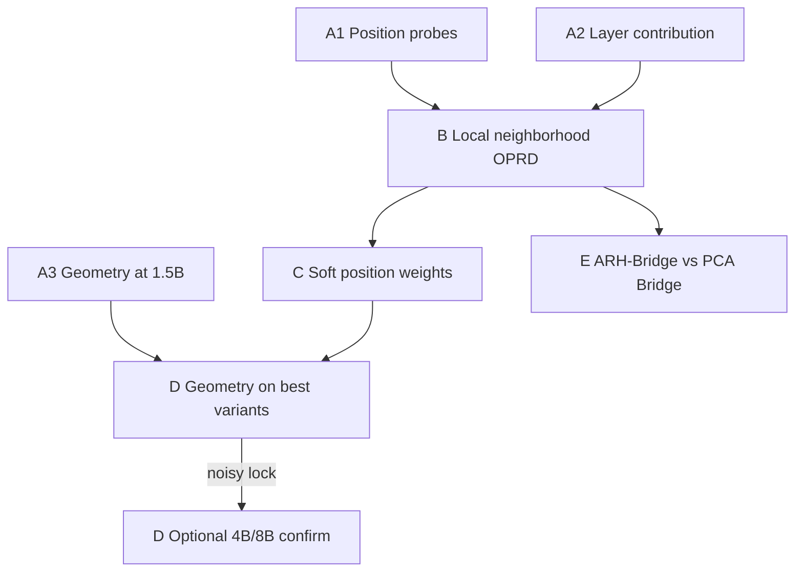

# Relational OPRD Experimental Research Plan

## Scope

Study five questions about [[on-policy-representation-distillation|OPRD]], **excluding** positive/negative contrastive (InfoNCE/CRD-style) objectives:

1. **Relational / ARH objective**: Can matching teacher–student *local neighborhood relations* beat or complement pointwise MSE?
2. **Position bias**: Does OPRD inherit OPD’s prefix/suffix asymmetry, and can soft position weights help?
3. **Update geometry**: Does OPRD preserve, expand, or escape OPD’s early subspace lock?
4. **Layer selectivity**: Can updating (or supervising) only middle / selected layers match full-network OPD/OPRD, as in RL layer contribution?
5. **Cross-architecture Bridge**: Can an ARH-compatible bridge replace OPRD-Bridge’s PCA+MSE under width/depth mismatch?

Deliverable for now: this Cursor plan only. No wiki edits until you ask.

## Motivation: PRH vs ARH for OPRD-Bridge

OPRD-Bridge motivates a frozen low-rank PCA teacher projector + student linear map + MSE by a Platonic-style claim: heterogeneous models share a low-rank representational subspace. [[aristotelian-representation-hypothesis|ARH]] (Gröger et al., 2026) refines this: after width/depth null-calibration, **global spectral alignment (CKA, Procrustes, RV) largely loses its scaling signal**, while **local neighborhood overlap (mutual kNN / CKNNA) remains**. Critically, ARH also finds that **local distances** do not survive calibration — only **who is near whom**.

Implication for this plan:

- PCA + projected MSE is a **PRH-flavored** bridge (shared global coordinates / spectral subspace).
- Full Gram / CKA matching is still closer to global second-order geometry than ARH’s claim.
- ARH-compatible objectives should transfer **neighbor identity / ranking**, not absolute coordinates or exact pairwise distances.

## Hybrid Scale Strategy

**Default training stack (Phase A–C):** match OPRD — ~1.5B student/teacher, math rollouts (DAPO-Math-style), AIME/AIMO-style eval. Cheap enough for position, relational, and layer ablations.

**Geometry confirmation (Phase D subset):** if 1.5B stable-rank / subspace-similarity curves are noisy or inconclusive, re-run the *geometry diagnostic battery only* on a Qwen3-4B or 8B pair with fewer seeds and fewer variants (OPD vs OPRD vs OPD+OPRD). Full relational/position grids stay at 1.5B.

Rationale: OPD Geometry used 8B for clean SVD, but the diagnostics themselves are scale-agnostic; 1.5B is enough to detect a lock and compare objectives. Larger models are a confirmation budget, not a prerequisite.

## Baselines (every phase)

- Student SFT / base checkpoint used by OPRD setup
- Standard OPD (uniform reverse-KL on student rollouts)
- OPRD (all-layer MSE, last-k tokens as in paper)
- OPD + OPRD (`L = L_OPD + μ L_OPRD`)

Optional later controls (not Phase A): ExOPD reward scale, EOPD entropy gate — only if needed to show gains are not just “stronger OPD.”

## Phase A — Diagnostics Before New Losses

Goal: establish whether OPRD already has position and layer structure.

**A1. Position probes (OPD and OPRD separately)**

- Train with supervision restricted to prefix-30%, middle-30%, suffix-30%, last-2000 (OPRD default), and full response
- Log per-position: output KL, hidden MSE/cosine by layer, teacher entropy, student entropy, cumulative prefix drift (IW-OPD style)
- Hypothesis: OPD is prefix-heavy; OPRD may retain more late-token signal than output KL

**A2. Layer contribution for OPD (and OPRD if compute allows)**

- Mirror [[is-one-layer-enough-rl-training|Is One Layer Enough?]]: freeze all but layer `k`, update only `θ_k`, compute `C(k)` vs full OPD
- Also try middle-k heuristic (40–60% depth) without full profiling
- For OPRD, distinguish **parameter update** selectivity vs **loss supervision** selectivity (which layers enter `L_OPRD`)
- Hypothesis: OPD middle-layer concentration exists but is flatter than RL; OPRD needs a broader depth band for supervision

**A3. Geometry baseline at 1.5B**

Reuse [[on-the-geometry-of-on-policy-distillation|OPD Geometry]] metrics on matched checkpoints:

- stable rank of `ΔW_t`, Frobenius norm, early-to-final top-16 subspace similarity
- rank-constrained training: project gradients onto early OPD subspace; test whether OPRD still improves
- Compare OPD vs OPRD vs OPD+OPRD

Stop criterion for scale-up: if stable-rank curves are too noisy to rank methods, schedule Phase D on 4B/8B.

## Phase B — ARH-Aligned Relational OPRD (No Negatives)

Replace or augment pointwise MSE with **local neighborhood / rank relations**, not instance-discrimination contrastive loss and not PCA coordinate matching.

### ARH-first primary objective (default)

Same-layer, same-sequence, on sampled windows. For each token `i`, take teacher’s top-`k` neighbors among other window tokens (or a fixed local radius), then match **neighbor identity / soft ranking** in the student:

```text
N_T(i) = top-k neighbors of h_T[i] in the window
L_mknn = 1 - |N_T(i) ∩ N_S(i)| / k     # hard mutual-kNN style

# preferred differentiable form (local Softmax / rank matching):
p_T(j|i) = softmax_{j in C(i)}(sim(h_T[i], h_T[j]) / τ)
p_S(j|i) = softmax_{j in C(i)}(sim(h_S[i], h_S[j]) / τ)
L_local = Σ_i KL(p_T(·|i) || p_S(·|i))
```

where `C(i)` is a local candidate set (top-k teacher neighbors, or a temporal neighborhood), **not** the full sequence. This matches ARH’s surviving signal: who is near whom, not exact distances.

Precedents outside InfoNCE: Local Structure Preserving (GCN KD), rank/distribution relational matching (LLP-style), mutual-kNN metrics from ARH itself.

### Controls (less ARH-pure)

- MSE-only (OPRD)
- Full-window Gram Frobenius / row-wise KL over all pairs (global relational; closer to PRH/CKA)
- Hybrid: `L_OPRD_MSE + λ L_local` (default first bet for same-architecture OPRD)
- Optional: [[phf|PHF]]-style hidden *transitions* as a separate arm (process geometry; not ARH’s cross-model claim, but useful for on-policy dynamics)

**Out of scope:** InfoNCE, memory-bank negatives, cross-prompt positives/negatives, Contrastive Neighborhood Alignment (uses contrastive loss).

Hypothesis: local neighborhood matching beats full Gram when architectures differ; for same-architecture OPRD, hybrid MSE + local relations is the safest first win. Full Gram may overfit metric distances that ARH says do not transfer.

## Phase C — Position-Aware OPRD

Apply soft weights to the best Phase B objective (likely hybrid relational + MSE).

**Weight candidates (soft, not hard delete first):**

1. IW-OPD-style cumulative prefix discrepancy
2. Hidden-discrepancy weight (capped)
3. TIP Soft-OR: student entropy × teacher–student disagreement (output or hidden)
4. FiRe-style: teacher confidence × student confusion, trajectory-normalized

**Also:** FiRe-style trajectory filter (drop bottom ~20% by teacher likelihood) as a cheap orthogonal knob.

Hypothesis: soft position weights help OPD more than OPRD; if OPRD’s useful signal is late, IW-style prefix bias may *hurt* OPRD — so measure before adopting IW as default.

## Phase D — Geometry Confirmation and Composition

1. Re-run Phase A3 geometry battery on best Phase B/C variant vs OPD/OPRD baselines at 1.5B
2. If inconclusive, confirm on 4B or 8B with only: OPD, OPRD, best relational, best position-aware
3. Decisive tests:
   - Freeze updates into early OPD locked subspace: does relational OPRD still work?
   - Project OPRD gradients orthogonal to OPD locked subspace: do hidden gains remain?
   - Does position weighting change spectral *shape* (OPD Geometry found token sparsification mostly rescales magnitude)?

## Phase E — ARH-Bridge vs OPRD-Bridge (Cross-Architecture)

Run after Phase B has a working local-neighborhood loss. Target: teacher/student with different width and/or depth (OPRD-Bridge setting), same on-policy rollouts.

**Baselines**

- Output-space OPD only (shared vocab assumed; skip if cross-tokenizer)
- OPRD-Bridge: frozen teacher PCA + trained student projector + MSE in rank-`r` space (paper recipe)
- No-bridge projected MSE (learned linear map without PCA teacher basis)

**ARH-Bridge (default new method)**

Do **not** force shared PCA coordinates. Instead:

1. Map layers by proportional depth (as in OPRD-Bridge)
2. On each student rollout window, compute teacher local neighborhoods in teacher hidden space
3. Train student so the same token indices remain neighbors under student similarities (local Softmax/KL or soft mutual-kNN)
4. Keep optional light OPD on logits if vocab is shared; for cross-tokenizer, neighborhood loss alone + optional answer-level supervision

**Diagnostics**

- Calibrated mKNN / mutual-kNN between teacher and student (ARH metric), not only uncalibrated CKA
- Uncalibrated CKA and PCA-subspace cosine as PRH-style controls
- Downstream AIME/AIMO; response length / Dist-n diversity as in OPRD-Bridge

Hypothesis: ARH-Bridge beats PCA+MSE when width/depth differ because it transfers the structure ARH says actually aligns; PCA+MSE may look aligned in CKA while transferring brittle global coordinates.

## Evaluation

- **Capability:** AIME 2024/2025, AIMO / MATH-style averages; report Avg@k and Pass@k where diversity matters
- **Efficiency:** wall-clock, peak memory, mean response length
- **Mechanistic:** hidden cosine/MSE by layer and position; **mutual-kNN / local-rank alignment** (ARH); CKA as control; stable rank / subspace similarity
- **Layer:** `C(k)` tables for OPD; selected-layer OPRD supervision ablations
- **Bridge:** calibrated local neighborhood agreement vs PCA-subspace MSE

## Experiment Sequence (Execution Order)



1. A1 + A3 in parallel if GPU allows; A2 can share the same OPD codebase
2. B local-neighborhood hybrid OPRD (Gram as control)
3. C soft weights on best B
4. D geometry; scale up only if needed
5. E cross-architecture Bridge once B’s local loss is stable

## Success Criteria

- **Relational:** local-neighborhood hybrid beats MSE OPRD on math avg without large diversity collapse; beats full-Gram when they diverge
- **Position:** clear prefix/suffix asymmetry map for OPRD; at least one soft weight improves sample efficiency or final score
- **Geometry:** qualitative answer — OPRD preserves / expands / escapes OPD lock — with rank-constrained evidence
- **Layers:** either middle-k OPD matches full OPD, or contribution profile is demonstrably flatter than RL
- **Bridge:** ARH-Bridge matches or beats OPRD-Bridge on cross-width/depth; mutual-kNN rises even when PCA-subspace MSE / CKA do not

## Risks and Mitigations

- **Gram / kNN cost:** windowed candidates; top-k teacher neighbors only; never full 2000×2000 all-layer by default
- **Relation-only underfits head:** keep hybrid and/or small `μ` OPD term when vocab is shared
- **Hard kNN non-diff:** use soft local Softmax/KL as training loss; report hard mKNN as metric
- **1.5B geometry noise:** predefine Phase D scale-up trigger (unstable rank ranking across seeds)
- **Confounding stronger OPD:** hold rollout policy and data fixed; change one axis per ablation
- **ARH is a measurement claim:** treat it as design prior for Bridge; still ablate against PCA+MSE empirically

## Anchor Sources (wiki)

- [wiki/sources/on-policy-representation-distillation.md](wiki/sources/on-policy-representation-distillation.md)
- [wiki/sources/aristotelian-representation-hypothesis.md](wiki/sources/aristotelian-representation-hypothesis.md)
- [wiki/sources/on-the-position-bias-of-on-policy-distillation.md](wiki/sources/on-the-position-bias-of-on-policy-distillation.md)
- [wiki/sources/on-the-geometry-of-on-policy-distillation.md](wiki/sources/on-the-geometry-of-on-policy-distillation.md)
- [wiki/sources/is-one-layer-enough-rl-training.md](wiki/sources/is-one-layer-enough-rl-training.md)
- [wiki/sources/phf.md](wiki/sources/phf.md), [wiki/sources/fire-opd.md](wiki/sources/fire-opd.md), [wiki/sources/tip-token-importance-opd.md](wiki/sources/tip-token-importance-opd.md)
- Literature synthesis: [wiki/comparisons/oprd-literature-review.md](wiki/comparisons/oprd-literature-review.md) (reference only; not rewritten in this pass)
