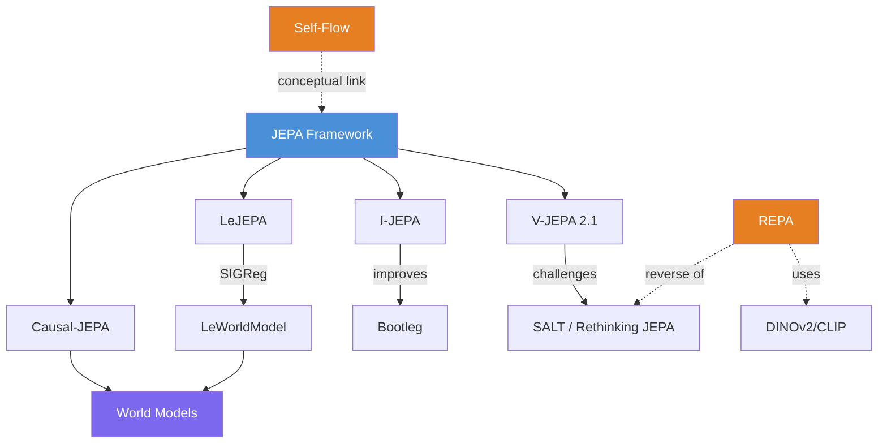

# ML Research Wiki — Overview

This wiki is a persistent, evolving knowledge base covering **self-supervised representation learning** and related ML research. It is maintained by LLM agents and designed to be browsed in Obsidian.

## Current Focus

**Self-supervised representation learning**, with particular emphasis on the [[jepa|JEPA]] (Joint-Embedding Predictive Architecture) paradigm and its variants.

## Current State

**8 sources ingested** | **8 concept pages** | **4 entity pages** | 20 total pages

## Key Themes

### 1. The EMA Debate
The most prominent thread across the wiki. [[ema|EMA]]-based self-distillation has been the default mechanism for preventing [[representation-collapse|representation collapse]] in JEPA, but three papers challenge this:
- [[lejepa|LeJEPA]] argues EMA is a theoretically unjustified heuristic and proposes SIGReg regularization
- [[rethinking-jepa|SALT]] shows a frozen teacher outperforms EMA-based V-JEPA 2
- [[leworldmodel|LeWorldModel]] achieves stable training with SIGReg alone

Meanwhile, [[v-jepa-2-1|V-JEPA 2.1]] achieves state-of-the-art with EMA, suggesting the debate is far from settled.

### 2. Dense vs. Global Features
Standard JEPA learns global scene representations but loses spatial detail. Multiple papers address this:
- [[v-jepa-2-1|V-JEPA 2.1]]: all-token prediction forces spatial grounding
- [[bootleg|Bootleg]]: multi-layer distillation captures features at all abstraction levels
- [[v-jepa-2-1|V-JEPA 2.1]] + [[bootleg|Bootleg]] independently converge on the idea that intermediate-layer supervision improves spatial quality

### 3. World Models from JEPA
Two papers extend JEPA from representation learning to [[world-models|world models]]:
- [[causal-jepa|Causal-JEPA]]: object-level masking for causal reasoning (1% of features, comparable planning)
- [[leworldmodel|LeWorldModel]]: end-to-end from pixels with minimal hyperparameters (48x faster planning)

### 4. Bridging Generative and Discriminative Learning
Two symmetric approaches connect generative models and representation learning:

- **[[repa|REPA]]**: Aligns diffusion transformer representations → frozen visual encoder (DINOv2). Accelerates training 17.5x.
- **[[rethinking-jepa|SALT]]**: Aligns visual encoder → frozen generative teacher (MAE-trained). Outperforms V-JEPA 2.
- **[[self-flow|Self-Flow]]**: Learns both intrinsically via Dual-Timestep Scheduling — no external models needed.

REPA and SALT are conceptual mirrors: one makes generative models more discriminative, the other makes discriminative models learn from generative objectives.

### 5. Theoretical Foundations
[[lejepa|LeJEPA]] provides the first rigorous theoretical framework for JEPA:
- Proves isotropic Gaussian is the optimal embedding distribution
- Derives SIGReg with linear complexity
- Eliminates all heuristics (~50 lines of code)
- Validated across 60+ architectures

## Key Relationships

## Open Questions

1. **Is EMA necessary?** The strongest results ([[v-jepa-2-1|V-JEPA 2.1]]) still use EMA, but principled alternatives exist. Would V-JEPA 2.1 be better without EMA?
2. **Optimal masking strategy?** Patch-level vs. object-level ([[causal-jepa|C-JEPA]]) vs. heterogeneous noise ([[self-flow|Self-Flow]])
3. **JEPA vs. generative representations**: How do JEPA and [[self-flow|Self-Flow]] representations compare on shared benchmarks?
4. **Scaling laws**: Do all JEPA variants scale equally well, or do some approaches have inherent scaling advantages?
5. **Combining innovations**: Can SIGReg + frozen teacher + multi-layer distillation + dense prediction be combined?

## Knowledge Gaps

> [!gap]
> No papers on JEPA applied to **language** or **audio** in the wiki yet. [[self-flow|Self-Flow]] covers audio generation but in the flow matching paradigm, not JEPA.

> [!gap]
> No direct **benchmark comparisons** across all methods on shared evaluation protocols. Each paper uses different baselines and metrics.

> [!gap]
> Missing coverage of **contrastive learning** methods (SimCLR, MoCo, DINO) as reference points for evaluating JEPA's advantages.
