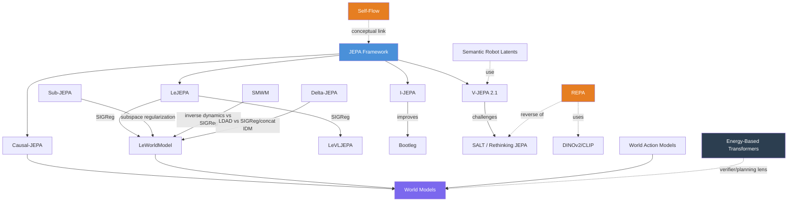

# ML Research Wiki — Overview

This wiki is a persistent, evolving knowledge base covering **self-supervised representation learning** and related ML research. It is maintained by LLM agents and designed to be browsed in Obsidian.

## Current Focus

**Self-supervised representation learning**, with particular emphasis on the [[jepa|JEPA]] (Joint-Embedding Predictive Architecture) paradigm and its variants.

## Current State

**65 sources ingested** | **19 concept pages** | **7 entity pages** | **3 comparison pages** | 94 source/concept/entity/comparison pages | 98 wiki Markdown files

## Key Themes

### 1. The EMA Debate
The most prominent thread across the wiki. [[ema|EMA]]-based self-distillation has been the default mechanism for preventing [[representation-collapse|representation collapse]] in JEPA, but three papers challenge this:
- [[lejepa|LeJEPA]] argues EMA is a theoretically unjustified heuristic and proposes SIGReg regularization
- [[rethinking-jepa|SALT]] shows a frozen teacher outperforms EMA-based V-JEPA 2
- [[leworldmodel|LeWorldModel]] achieves stable training with SIGReg alone

Meanwhile, [[v-jepa-2-1|V-JEPA 2.1]] achieves state-of-the-art with EMA, suggesting the debate is far from settled. See [[ema-vs-non-ema-collapse-prevention]] for a filed comparison.

### 2. Dense vs. Global Features
Standard JEPA learns global scene representations but loses spatial detail. Multiple papers address this:
- [[v-jepa-2-1|V-JEPA 2.1]]: all-token prediction forces spatial grounding
- [[bootleg|Bootleg]]: multi-layer distillation captures features at all abstraction levels
- [[v-jepa-2-1|V-JEPA 2.1]] + [[bootleg|Bootleg]] independently converge on the idea that intermediate-layer supervision improves spatial quality
- [[levljepa|LeVLJEPA]]: non-contrastive vision-language pretraining produces **stronger patch-token** semantics than CLIP/SigLIP for VLM backbones and segmentation, despite weaker zero-shot — zero-shot and backbone quality can be inversely related

### 3. World Models from JEPA
Multiple papers extend representation learning into [[world-models|world models]]:
- [[causal-jepa|Causal-JEPA]]: object-level masking for causal reasoning (1% of features, comparable planning)
- [[leworldmodel|LeWorldModel]]: end-to-end from pixels with minimal hyperparameters (48x faster planning)
- [[sub-jepa|Sub-JEPA]]: subspace Gaussian regularization improves LeWM-style end-to-end world models
- [[sensorimotor-world-models|SMWM]]: inverse dynamics regularization prevents collapse and biases latents toward controllable DoF ("perception for action")
- [[delta-jepa|Delta-JEPA]]: Latent Difference Action Decoding ($\Delta z_t$) replaces SIGReg and concat inverse dynamics for action-sensitive rollouts
- [[fast-leworldmodel|Fast-LeWM]]: parallel action-prefix prediction removes repeated one-step latent rollout, halving CEM solve time while improving average success
- [[prism-prior-guided-imagination-sampling|PRISM]]: a lightweight uncertainty-aware action prior from frozen LeWM features improves low-budget MPPI proposals with negligible inference overhead
- [[sampling-based-latent-planning|Sampling-Based Latent Planning]] separates representation geometry, dynamics queries, and candidate proposals as distinct planning bottlenecks
- [[adajepa|AdaJEPA]]: test-time adaptation in the MPC loop recalibrates frozen JEPA world models under visual, dynamics, and layout shifts
- [[dino-wm|DINO-WM]] → [[temporal-straightening|Temporal Straightening]] → [[adajepa|AdaJEPA]]: latent planning pipeline from frozen DINOv2 features, to straightened JEPA geometry, to deployment adaptation
- [[reconstruction-or-semantics-robotic-world-models|Reconstruction or Semantics]]: semantic latents beat reconstruction latents for robotic policy-relevant rollouts
- [[world-action-models|World Action Models]] and [[world-model-for-robot-learning-survey|World Model for Robot Learning]] organize the broader robotics landscape — see [[robot-world-model-architectures]] for a filed architecture comparison

### 4. Bridging Generative and Discriminative Learning
Two symmetric approaches connect generative models and representation learning:

- **[[repa|REPA]]**: Aligns diffusion transformer representations → frozen visual encoder (DINOv2). Accelerates training 17.5x.
- **[[rethinking-jepa|SALT]]**: Aligns visual encoder → frozen generative teacher (MAE-trained). Outperforms V-JEPA 2.
- **[[self-flow|Self-Flow]]**: Learns both intrinsically via Dual-Timestep Scheduling — no external models needed.

REPA and SALT are conceptual mirrors: one makes generative models more discriminative, the other makes discriminative models learn from generative objectives.

### 5. Theoretical Foundations
[[lejepa|LeJEPA]] provides the first rigorous theoretical framework for JEPA:
- Proves isotropic Gaussian is the optimal embedding distribution
- Derives SIGReg with linear complexity
- Eliminates all heuristics (~50 lines of code)
- Validated across 60+ architectures

Newer theory pages broaden this theme:
- [[energy-based-models|Energy-Based Models]] connect learned verifiers, inference-time optimization, and autoregressive lookahead.
- [[iterative-refinement|Iterative Refinement]] connects looped transformers, fixed-point attractor models, stochastic recursive reasoning (GRAM), attractor landscapes (EqR), inference-time width scaling (PTRM), vision-centric reasoning (VARC), continuous latent CoT (NF-CoT, LOTUS), supervised memory training (SMT), and energy-based inference.
- [[fixed-point-reasoners|FPRM]]: pre-norm + residual scaling enables stable deep looped Transformers with native fixed-point halting — outperforms hierarchical TRM/HRM on Sudoku/Maze at 7M params without external ACT.
- [[learn-from-your-own-latents|Learn from your own latents]]: latent prediction can be exponentially more sample-efficient than token-level SSL on hierarchical data.
- [[representation-geometry|Representation Geometry]] separates global embedding statistics from functional sensitivity, divergent task geometry, intrinsic manifolds, parameter-space update geometry, and layer-wise RL contribution structure during LLM post-training.
- [[elucidating-representation-degradation|ERD]] analyzes diffusion training through recoverability mismatch and representation degradation.
- [[augmented-lagrangian-predictive-coding|PC-ALM]] connects predictive coding to augmented Lagrangian optimization, achieving exact BP gradients via local dynamics.

### 6. JEPA Regularization Beyond SIGReg
[[visreg|VISReg]] refines the [[lejepa|LeJEPA]] regularization story with decoupled scale/shape/center objectives and sliced Wasserstein shape matching, claiming stronger anti-collapse gradients and OOD transfer than SIGReg. [[levljepa|LeVLJEPA]] extends SIGReg to vision-language pretraining without contrastive negatives. [[sensorimotor-world-models|SMWM]] and [[delta-jepa|Delta-JEPA]] offer action-aligned world-model alternatives: concat inverse dynamics vs latent-displacement decoding.

### 7. Representation Geometry and Control
Three papers shift the wiki from static representations toward controllable or functional ones:
- [[global-geometry-is-not-enough|Global Geometry Is Not Enough]]: global isotropy/effective rank do not predict compositional binding; Jacobian Effective Rank does.
- [[manifold-steering|Manifold Steering]]: following intrinsic activation manifolds produces more natural behavior than linear steering.
- [[steerable-visual-representations|Steerable Visual Representations]]: language adapters can redirect frozen visual features toward prompted concepts.
- [[convergent-world-representations-and-divergent-tasks|Convergent World Representations]]: multi-task training converges world geometry, but divergent fine-tuning tasks can fracture it.
- [[aristotelian-representation-hypothesis|Aristotelian Representation Hypothesis]]: raw CKA/global similarity is confounded by width and depth; calibrated local neighborhood overlap (mKNN) retains cross-modal convergence trends.

### 8. On-Policy Distillation and Post-Training Geometry
The wiki now has a focused [[on-policy-distillation|OPD]] cluster for studying representation-level distillation, token weighting, and update geometry:
- [[on-the-geometry-of-on-policy-distillation|OPD Geometry]]: OPD occupies a relaxed off-principal regime between SFT and RLVR, with subspace locking — updates rapidly enter a low-dimensional, functionally sufficient channel.
- [[on-the-position-bias-of-on-policy-distillation|Position Bias OPD]]: teacher supervision degrades along student rollouts; IW-OPD reweights tokens by prefix compatibility for faster convergence and +6.9 AIME25 gains.
- [[on-policy-representation-distillation|OPRD]]: lifts distillation from output-space KL to hidden-state alignment, providing zero-variance gradients and bypassing the LM-head information bottleneck.
- [[learning-beyond-teacher|ExOPD]], [[entropy-aware-opd|EOPD]], [[tip-token-importance-opd|TIP]], [[fire-opd|FiRe-OPD]], and [[selectkd|SelecTKD]] map the design space of stronger output-space OPD and token-selective distillation baselines.
- [[contrastive-representation-distillation|CRD]], [[codir|CoDIR]], [[distiller|Distiller]], and [[phf|PHF]] provide candidate representation objectives for contrastive, relational, and hidden-flow OPRD variants.
- [[is-one-layer-enough-rl-training|Is One Layer Enough?]]: RL gains concentrate in middle transformer layers; a single layer can match or exceed full-parameter GRPO; layer-aware selective training outperforms uniform RL.

See [[oprd-literature-review]] for the experiment-facing synthesis: contrastive OPRD should begin conservatively because of false-negative risk; position-aware OPRD is likely the lowest-risk first variant; OPRD geometry should reuse OPD stable-rank and rank-constrained diagnostics.

### 9. Alternative Reasoning and Training Paradigms
- [[arc-is-a-vision-problem|VARC]]: reframes ARC as a vision problem; 18M ViT matches human performance with visual priors alone.
- [[latent-reasoning-with-normalizing-flows|NF-CoT]]: continuous Chain-of-Thought via autoregressive normalizing flows with tractable likelihoods and KV-cache compatibility.
- [[lotus|LOTUS]]: looped padded Transformers with parallel gold CoT supervision; approaches explicit CoT at 3B with 2–7× lower thought-phase latency.
- [[pretraining-recurrent-networks-without-recurrence|SMT]]: time-parallel RNN pretraining without BPTT via Transformer-generated memory labels.

### 10. Efficient Generative World Modeling
- [[delta-world|DeltaWorld]]: DeltaTok compresses temporal frame changes to one token in VFM feature space; Best-of-Many training generates diverse futures in a single pass at 2,000× fewer FLOPs than Cosmos.

### 11. Architectural Limits of Feedforward Transformers
- [[topological-trouble-with-transformers|Topological Trouble With Transformers]]: feedforward depth topology prevents indefinite dynamic state tracking; motivates recurrence, SSMs, and implicit latent state over CoT workarounds.
- [[next-latent-prediction|NextLat]]: injects belief-state pressure via next-latent prediction; provably shapes compact world models and enables 3.3× self-speculative decoding.

### 12. Minimal-Assumption Representation Learning
- [[temporal-difference-vision|TDV]]: learns from video using only causal next-frame prediction — no augmentations, masking, or cropping; matches SOTA on dense spatial tasks.

### 13. Physical and Oscillator-Based Generation
- [[un-0-coupled-oscillators|Un-0]]: replaces neural backbones with coupled Kuramoto oscillator dynamics for class-conditional image generation; FID 6.74 on ImageNet 64×64. Validates mapping modern generative workloads to physical substrates toward ~1000× energy efficiency. Dynamics handle diversity (recall); small decoder handles quality (precision).

### 14. Learnable Novelty and Bounded Observers
- [[intelligence-from-learnable-novelty|Intelligence from Learnable Novelty]] reframes epiplexity as the structured portion of surprise that a computationally bounded observer can absorb.
- The same closed-form reservoir score ranks complex cellular automata, induces label-free class structure on [[mnist|MNIST]], and supplies a stable intrinsic exploration bonus across ten RL tasks.
- [[learnable-novelty|Learnable Novelty]] broadens the wiki beyond fixed SSL objectives by making observer capacity part of the definition of useful structure. The central unresolved issue is whether observer and observed system can co-evolve without collusion or saturation.

## Key Relationships

```mermaid
graph TD
    JEPA[JEPA Framework] --> VJEPA[V-JEPA 2.1]
    JEPA --> IJEPA[I-JEPA]
    JEPA --> LeJEPA[LeJEPA]
    JEPA --> CJEPA[Causal-JEPA]
    
    LeJEPA -->|SIGReg| LeWM[LeWorldModel]
    LeJEPA -->|SIGReg| LeVLJEPA[LeVLJEPA]
    IJEPA -->|improves| Bootleg[Bootleg]
    VJEPA -->|challenges| SALT[SALT / Rethinking JEPA]
    
    CJEPA --> WM[World Models]
    LeWM --> WM
    
    SelfFlow[Self-Flow] -.->|conceptual link| JEPA
    REPA[REPA] -.->|uses| DINOv2[DINOv2/CLIP]
    REPA -.->|reverse of| SALT
    SubJEPA[Sub-JEPA] -->|subspace regularization| LeWM
    SMWM[SMWM] -->|inverse dynamics vs SIGReg| LeWM
    DeltaJEPA[Delta-JEPA] -->|LDAD vs SIGReg/concat IDM| LeWM
    SemLatents[Semantic Robot Latents] -.->|use| VJEPA
    WAM[World Action Models] --> WM
    EBT[Energy-Based Transformers] -.->|verifier/planning lens| WM
    
    style JEPA fill:#4a90d9,color:#fff
    style WM fill:#7b68ee,color:#fff
    style SelfFlow fill:#e67e22,color:#fff
    style REPA fill:#e67e22,color:#fff
    style EBT fill:#2c3e50,color:#fff
```

## Open Questions

1. **Is EMA necessary?** The strongest results ([[v-jepa-2-1|V-JEPA 2.1]]) still use EMA, but principled alternatives exist. Would V-JEPA 2.1 be better without EMA?
2. **Optimal masking strategy?** Patch-level vs. object-level ([[causal-jepa|C-JEPA]]) vs. heterogeneous noise ([[self-flow|Self-Flow]])
3. **JEPA vs. generative representations**: How do JEPA and [[self-flow|Self-Flow]] representations compare on shared benchmarks?
4. **Scaling laws**: Do all JEPA variants scale equally well, or do some approaches have inherent scaling advantages?
5. **Combining innovations**: Can SIGReg + frozen teacher + multi-layer distillation + dense prediction be combined?
6. **Geometry vs. function**: Which representation diagnostics actually predict compositional binding, steerability, and robot-control utility? Should cross-model CKA claims use null calibration ([[aristotelian-representation-hypothesis|ARH]])?
7. **World model evaluation**: How should benchmarks jointly score visual plausibility, physical consistency, action faithfulness, and closed-loop policy success?
8. **Vision vs. language for abstraction**: Does [[arc-is-a-vision-problem|VARC]]'s success indicate ARC is fundamentally visual, or can vision and recursive reasoning be combined?
9. **Representation vs. output distillation**: When does hidden-state alignment ([[on-policy-representation-distillation|OPRD]]) outperform output-space OPD, and how does it interact with subspace locking?
10. **Layer-wise RL adaptation**: Can [[layer-contribution-rl|layer contribution]] profiles replace expensive per-layer profiling in production RL pipelines, and why do middle layers disproportionately absorb RL improvement?
11. **Position vs representation distillation**: Can [[on-the-position-bias-of-on-policy-distillation|IW-OPD]], [[tip-token-importance-opd|TIP]], or [[fire-opd|FiRe-OPD]] weighting improve [[on-policy-representation-distillation|OPRD]] without suppressing useful late hidden-state signal?
12. **Temporal compression for world models**: Can DeltaTok-style delta tokens integrate with JEPA end-to-end training, or do they require frozen VFM features?
13. **Recurrence vs. retrieval**: Does [[topological-trouble-with-transformers|state-tracking topology]] require explicit recurrence, or can enhanced SSMs and training objectives approximate it within feedforward architectures?
14. **Minimal assumptions at scale**: Will [[temporal-difference-vision|TDV]]'s causal-only objective eventually surpass augmentation-based SSL as data grows, as the paper's scaling experiments suggest?
15. **Belief states in LLMs**: Can [[next-latent-prediction|NextLat]]-style objectives fix incoherent implicit world models in language transformers without architectural changes?
16. **Physics-as-compute scaling**: Can [[coupled-oscillators|oscillator-based]] generators close the quality gap with EDM-class diffusion at comparable parameter counts, or is a new physical primitive needed?
17. **Adaptive world models**: Can [[adajepa|AdaJEPA]]-style closed-loop TTA scale to pixel-level or video world models, or is it limited to compact latent JEPA planners?
18. **Hierarchy vs signal propagation**: Is hierarchical looping in TRM/HRM irreducible algorithmic structure, or primarily a workaround for post-norm depth limits that [[fixed-point-reasoners|FPRM]] makes unnecessary?
19. **Adaptive bounded observers**: Can [[learnable-novelty|learnable novelty]] scale beyond fixed random reservoirs by co-training observer and generator without creating arbitrary private codes or losing the compute-bound interpretation?
20. **Latent planning budget**: How should [[sampling-based-latent-planning|latent MPC]] divide compute among representation quality, rollout horizon, [[fast-leworldmodel|parallel prediction]], [[prism-prior-guided-imagination-sampling|proposal guidance]], and online adaptation?

## Knowledge Gaps

> [!gap]
> No papers on JEPA applied to **audio** in the wiki yet. [[self-flow|Self-Flow]] covers audio generation but in the flow matching paradigm, not JEPA. [[levljepa|LeVLJEPA]] covers vision-language but not language-only or audio-language JEPA.

> [!gap]
> No direct **benchmark comparisons** across all SSL methods on shared evaluation protocols. Each paper uses different baselines and metrics. Partial coverage: [[ema-vs-non-ema-collapse-prevention]] (collapse prevention), [[robot-world-model-architectures]] (robotics WM families).

> [!gap]
> **Contrastive learning** reference coverage added via [[contrastive-learning]] concept page; primary SimCLR/MoCo/DINO source papers not yet ingested.

> [!gap]
> [[robot-world-model-architectures]] files a partial comparison of JEPA, diffusion/video, and VLA-style world models, but no source runs all families on identical robot benchmarks with unified metrics.
