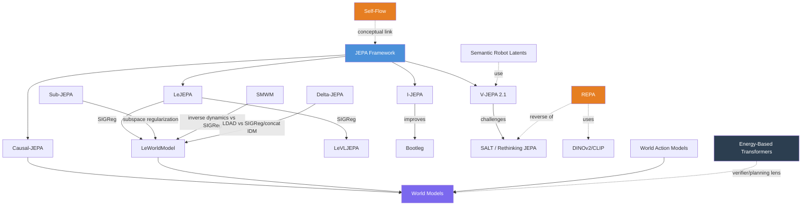

# ML Research Wiki — Overview

This wiki is a persistent, evolving knowledge base covering **self-supervised representation learning** and related ML research. It is maintained by LLM agents and designed to be browsed in Obsidian.

## Current Focus

**Self-supervised representation learning**, with particular emphasis on the [[jepa|JEPA]] (Joint-Embedding Predictive Architecture) paradigm and its variants.

## Current State

**106 sources ingested** | **36 concept pages** | **19 entity pages** | **6 comparison pages** | 167 source/concept/entity/comparison pages | 171 wiki Markdown files

## Key Themes

### 1. The EMA Debate
The most prominent thread across the wiki. [[ema|EMA]]-based self-distillation has been the default mechanism for preventing [[representation-collapse|representation collapse]] in JEPA, but three papers challenge this:
- [[lejepa|LeJEPA]] argues EMA is a theoretically unjustified heuristic and proposes SIGReg regularization
- [[rethinking-jepa|SALT]] shows a frozen teacher outperforms EMA-based V-JEPA 2
- [[leworldmodel|LeWorldModel]] achieves stable training with SIGReg alone

Meanwhile, [[v-jepa-2-1|V-JEPA 2.1]] achieves state-of-the-art with EMA, suggesting the debate is far from settled. See [[ema-vs-non-ema-collapse-prevention]] for a filed comparison.

### 2. Dense vs. Global Features
Standard JEPA learns global scene representations but loses spatial detail. Multiple papers address this:
- [[v-jepa-2-1|V-JEPA 2.1]]: all-token prediction forces spatial grounding
- [[bootleg|Bootleg]]: multi-layer distillation captures features at all abstraction levels
- [[v-jepa-2-1|V-JEPA 2.1]] + [[bootleg|Bootleg]] independently converge on the idea that intermediate-layer supervision improves spatial quality
- [[levljepa|LeVLJEPA]]: non-contrastive vision-language pretraining produces **stronger patch-token** semantics than CLIP/SigLIP for VLM backbones and segmentation, despite weaker zero-shot; zero-shot and backbone quality can be inversely related
- [[levjepa|LeVJEPA]]: collapse-free video pretraining extends SIGReg to a single encoder with 95% token dropping, block-causal attention, and much lower matched-epoch compute than V-JEPA 2
- [[better-slots-better-worlds|Better Slots, Better Worlds]]: object-centric slot quality tracks planning quality strongly on PushT and OGBench-Cube, while robustness depends on preserving object identity under appearance shifts
- [[patch-policy|Patch Policy]] and [[dense-visual-representations]]: frozen patch features extend the dense-over-global pattern into direct robot control, outperforming pooled features most strongly on precise multi-object tasks and beating OpenVLA-OFT on the evaluated in-domain tasks with far fewer parameters and lower latency

### 3. World Models from JEPA
Multiple papers extend representation learning into [[world-models|world models]]:
- [[causal-jepa|Causal-JEPA]]: object-level masking for causal reasoning (1% of features, comparable planning)
- [[leworldmodel|LeWorldModel]]: end-to-end from pixels with minimal hyperparameters (48x faster planning)
- [[semigroup-jepa|Semigroup-JEPA]]: gravity-conditioned recursive latent rollouts improve long-horizon prediction and control under held-out physics
- [[latent-energy-action-planning|LEAP]]: adds decoder-predicted terminal-state agreement and differentiable action refinement to frozen LeWM planning, raising matched four-domain mean success from 77.5% to 94.8%
- [[sub-jepa|Sub-JEPA]]: subspace Gaussian regularization improves LeWM-style end-to-end world models
- [[sensorimotor-world-models|SMWM]]: inverse dynamics regularization prevents collapse and biases latents toward controllable DoF ("perception for action")
- [[delta-jepa|Delta-JEPA]]: Latent Difference Action Decoding ($\Delta z_t$) replaces SIGReg and concat inverse dynamics for action-sensitive rollouts
- [[fast-leworldmodel|Fast-LeWM]]: parallel action-prefix prediction removes repeated one-step latent rollout, halving CEM solve time while improving average success
- [[prism-prior-guided-imagination-sampling|PRISM]]: a lightweight uncertainty-aware action prior from frozen LeWM features improves low-budget MPPI proposals with negligible inference overhead
- [[intact|INTACT]]: a shared local/goal intent-to-action operator jointly shapes the representation and enables Direct zero-candidate control, with bounded CEM retained as optional verification
- [[latent-geometry-beyond-search|GC-IDM]]: a horizon-conditioned inverse controller turns frozen LeWM latents into direct closed-loop actions, matching or beating CEM in seven of eight cells at 100 to 130 times lower per-plan-call cost
- [[latent-action-as-intention|LAWA]]: compact latent actions retain test-time future intention for World Action Models, reaching 80.8% full-data RoboCasa success at 42.9% lower latency than matched Joint-WAM
- [[sampling-based-latent-planning|Sampling-Based Latent Planning]] separates representation geometry, dynamics queries, candidate proposals, and direct inverse-control interfaces as distinct planning bottlenecks
- [[adajepa|AdaJEPA]]: test-time adaptation in the MPC loop recalibrates frozen JEPA world models under visual, dynamics, and layout shifts
- [[dino-wm|DINO-WM]] → [[temporal-straightening|Temporal Straightening]] → [[adajepa|AdaJEPA]]: latent planning pipeline from frozen DINOv2 features, to straightened JEPA geometry, to deployment adaptation
- [[reconstruction-or-semantics-robotic-world-models|Reconstruction or Semantics]]: semantic latents beat reconstruction latents for robotic policy-relevant rollouts
- [[world-action-models|World Action Models]] and [[world-model-for-robot-learning-survey|World Model for Robot Learning]] organize the broader robotics landscape - see [[robot-world-model-architectures]] for a filed architecture comparison
- [[what-matters-latent-actions|What Matters for Latent Actions]] + [[latent-actions|Latent Action Models]]: the wiki's first systematic treatment of latent action learning - 41 ablated design choices show VLM mid-training with latent actions beats OpenVLA baselines (+14.5% real-robot success), with JAP integration, $d_z=32$, and semantic $\Delta$DINO signals winning; connects to [[reconstruction-or-semantics-robotic-world-models|semantic-over-reconstruction]] evidence
- [[generalization-theory-for-jepa-world-models|JEPA World Model Generalization Theory]] links spectral approximation and finite-sample estimation to planning regret, while [[viscore|VIScore]] diagnoses whether representations, action-conditioned predictions, and planner search jointly support control
- [[leflow|LeFlow]] amortizes latent path proposals with rectified flow and uses a frozen world model for verification, improving success and reducing CEM planning time by roughly 4.5-14.4x
- [[driftworld|DriftWorld]] replaces iterative video diffusion with a single-step drifting field, reaching 30+ FPS and producing policy-ranking scores that correlate strongly with real outcomes
- [[better-slots-better-worlds|Better Slots, Better Worlds]] makes object-centricity a measurable planning interface: slot metrics predict success, but geometric contact shifts remain a shared failure mode

### 4. Bridging Generative and Discriminative Learning
Two symmetric approaches connect generative models and representation learning:

- **[[repa|REPA]]**: Aligns diffusion transformer representations → frozen visual encoder (DINOv2). Accelerates training 17.5x.
- **[[rethinking-jepa|SALT]]**: Aligns visual encoder → frozen generative teacher (MAE-trained). Outperforms V-JEPA 2.
- **[[self-flow|Self-Flow]]**: Learns both intrinsically via Dual-Timestep Scheduling — no external models needed.

REPA and SALT are conceptual mirrors: one makes generative models more discriminative, the other makes discriminative models learn from generative objectives.

### 5. Theoretical Foundations
[[lejepa|LeJEPA]] provides the first rigorous theoretical framework for JEPA:
- Proves isotropic Gaussian is the optimal embedding distribution
- Derives SIGReg with linear complexity
- Eliminates all heuristics (~50 lines of code)
- Validated across 60+ architectures

Newer theory pages broaden this theme:
- [[energy-based-models|Energy-Based Models]] connect learned verifiers, inference-time optimization, and autoregressive lookahead.
- [[iterative-refinement|Iterative Refinement]] connects looped transformers, fixed-point attractor models, stochastic recursive reasoning (GRAM), attractor landscapes (EqR), inference-time width scaling (PTRM), vision-centric reasoning (VARC), continuous latent CoT (NF-CoT, LOTUS), supervised memory training (SMT), and energy-based inference.
- [[reasoning-dynamics|Reasoning dynamics]] adds a route-level diagnostic: difficult tasks produce fractal settling-time basins when latent trajectories pass near saddles representing nearly correct solutions.
- [[fixed-point-reasoners|FPRM]]: pre-norm + residual scaling enables stable deep looped Transformers with native fixed-point halting — outperforms hierarchical TRM/HRM on Sudoku/Maze at 7M params without external ACT.
- [[learn-from-your-own-latents|Learn from your own latents]]: latent prediction can be exponentially more sample-efficient than token-level SSL on hierarchical data.
- [[jepa-paradox-in-language|The JEPA Paradox in Language]] adds a complementary boundary: deterministic latent point prediction can be ill-posed when one linguistic context has several separated valid continuations, even if marginal collapse is controlled.
- [[generalization-theory-for-jepa-world-models|JEPA World Model Generalization Theory]] derives an approximation-estimation trade-off in latent rank and connects spectral prediction error to downstream planning regret under explicit assumptions.
- [[representation-geometry|Representation Geometry]] separates global embedding statistics from functional sensitivity, divergent task geometry, intrinsic manifolds, parameter-space update geometry, and layer-wise RL contribution structure during LLM post-training.
- [[compositional-generalization]]: recurrent depth supports systematic composition and depth extrapolation in controlled knowledge-graph tasks, but the effect depends on training recurrence, initialization, and anti-shortcut data design.
- [[elucidating-representation-degradation|ERD]] analyzes diffusion training through recoverability mismatch and representation degradation.
- [[augmented-lagrangian-predictive-coding|PC-ALM]] connects predictive coding to augmented Lagrangian optimization, achieving exact BP gradients via local dynamics.

### 6. JEPA Regularization Beyond SIGReg
[[visreg|VISReg]] refines the [[lejepa|LeJEPA]] regularization story with decoupled scale/shape/center objectives and sliced Wasserstein shape matching, claiming stronger anti-collapse gradients and OOD transfer than SIGReg. [[levljepa|LeVLJEPA]] extends SIGReg to vision-language pretraining without contrastive negatives, while [[levjepa|LeVJEPA]] shows the same collapse-free principle can support efficient video pretraining with extreme token dropping. [[orthogonal-jepa|Orthogonal JEPA]] goes further structurally: learned orthogonal bases factorize one monolithic prediction into per-component branches with variance floors - fixing at the architecture level the dominant-signal capacity monopolization that motivates Theme 15. [[lpwm|LpWM]] questions the dense-isotropic target itself: RDMReg matches rectified projections to a Rectified Laplace (sparse, non-maximum-entropy) target, and the resulting non-negative codes need less predictor capacity for successful planning than LeWM's dense ones ([[sparse-representations]]). [[sensorimotor-world-models|SMWM]] and [[delta-jepa|Delta-JEPA]] offer action-aligned world-model alternatives: concat inverse dynamics vs latent-displacement decoding. On an orthogonal axis, [[remove-symmetries|syre]] removes *parameter-space* symmetry traps (dead neurons, rank shrinkage, plasticity loss) via a shifted weight-decay center - complementary to embedding-distribution regularizers rather than competing with them, but never yet combined with EMA or SIGReg in [[jepa|JEPA]] training.

### 7. Representation Geometry and Control
Several papers shift the wiki from static representations toward controllable or functional ones. [[dense-visual-representations]] adds spatial token granularity as a separate axis from trajectory curvature, local sensitivity, and downstream action interfaces:
- [[global-geometry-is-not-enough|Global Geometry Is Not Enough]]: global isotropy/effective rank do not predict compositional binding; Jacobian Effective Rank does.
- [[manifold-steering|Manifold Steering]]: following intrinsic activation manifolds produces more natural behavior than linear steering.
- [[steerable-visual-representations|Steerable Visual Representations]]: language adapters can redirect frozen visual features toward prompted concepts.
- [[convergent-world-representations-and-divergent-tasks|Convergent World Representations]]: multi-task training converges world geometry, but divergent fine-tuning tasks can fracture it.
- [[aristotelian-representation-hypothesis|Aristotelian Representation Hypothesis]]: raw CKA/global similarity is confounded by width and depth; calibrated local neighborhood overlap (mKNN) retains cross-modal convergence trends.
- [[patch-policy|Patch Policy]]: preserving spatial patch positions matters for direct control, while [[temporal-straightening|Temporal Straightening]] shows that channel compression can remain effective when spatial organization is retained and trajectory geometry is improved.
- [[looped-transformers-jacobian-lens|Looped Transformers under the Jacobian Lens]]: virtual-unrolled Jacobians show that recurrent models can reconstruct or transport workspace content differently; decodability, transport, and causal access must be tested separately.

### 8. On-Policy Distillation and Post-Training Geometry
The wiki now has a focused [[on-policy-distillation|OPD]] cluster for studying representation-level distillation, token weighting, and update geometry:
- [[on-the-geometry-of-on-policy-distillation|OPD Geometry]]: OPD occupies a relaxed off-principal regime between SFT and RLVR, with subspace locking — updates rapidly enter a low-dimensional, functionally sufficient channel.
- [[on-the-position-bias-of-on-policy-distillation|Position Bias OPD]]: teacher supervision degrades along student rollouts; IW-OPD reweights tokens by prefix compatibility for faster convergence and +6.9 AIME25 gains.
- [[on-policy-representation-distillation|OPRD]]: lifts distillation from output-space KL to hidden-state alignment, providing zero-variance gradients and bypassing the LM-head information bottleneck.
- [[lost-in-backpropagation|Lost in Backpropagation]] and [[lm-head-gradient-bottleneck]] separate three output-interface limits: softmax expressivity, hidden-state directions invisible to output supervision, and high-rank vocabulary errors compressed during backpropagation. The new evidence concerns general next-token training rather than OPD specifically.
- [[beta-opsd|β-OPSD]], [[learning-beyond-teacher|ExOPD]], [[entropy-aware-opd|EOPD]], [[tip-token-importance-opd|TIP]], [[fire-opd|FiRe-OPD]], and [[selectkd|SelecTKD]] map the design space of stronger output-space OPD and token-selective distillation baselines. β-OPSD specifically adds reference anchoring and return-to-go credit derived from a KL-regularized policy objective.
- [[latent-on-policy-self-distillation|LOPD]] adds privilege construction as a separate design axis: retrieved successful experiences are compressed into learned training-only context for a frozen self-teacher, while a margin constraint keeps the context informative during joint optimization. Its student retains the resulting tool-use behavior without retrieval at deployment.
- [[simpleopd|SimpleOPD]] adds exact surface-span alignment, termination masking, and reference anchoring for long-context transfer across incompatible tokenizers.
- [[self-supervised-visual-on-policy-distillation|S²VOPD]] extends the family to visual reasoning by giving the teacher a clean image and the student an answer-preserving degraded view; augmentation-derived privilege supplies most of the reported gain.
- [[opsa|OPSA]] revisits on-policy distillation's noisy teacher advantages and finds that entropy-adaptive negative updates on low-log-probability tokens can reproduce much of the gain without a teacher, reward, or hint model.
- [[best-practice-critic-optimization|BPCO]] provides a distinct single-rollout alternative to OPD: a carefully bounded and length-adaptive critic can match group-based training while using one response per prompt, but critic memory and reward-range assumptions remain explicit costs.
- [[contrastive-representation-distillation|CRD]], [[codir|CoDIR]], [[distiller|Distiller]], and [[phf|PHF]] provide candidate representation objectives for contrastive, relational, and hidden-flow OPRD variants.
- [[is-one-layer-enough-rl-training|Is One Layer Enough?]]: RL gains concentrate in middle transformer layers; a single layer can match or exceed full-parameter GRPO; layer-aware selective training outperforms uniform RL.

See [[oprd-literature-review]] for the experiment-facing synthesis: contrastive OPRD should begin conservatively because of false-negative risk; position-aware OPRD is likely the lowest-risk first variant; OPRD geometry should reuse OPD stable-rank and rank-constrained diagnostics.

### 9. Alternative Reasoning and Training Paradigms
- [[arc-is-a-vision-problem|VARC]]: reframes ARC as a vision problem; 18M ViT matches human performance with visual priors alone.
- [[latent-reasoning-with-normalizing-flows|NF-CoT]]: continuous Chain-of-Thought via autoregressive normalizing flows with tractable likelihoods and KV-cache compatibility.
- [[lotus|LOTUS]]: looped padded Transformers with parallel gold CoT supervision; approaches explicit CoT at 3B with 2–7× lower thought-phase latency.
- [[pretraining-recurrent-networks-without-recurrence|SMT]]: time-parallel RNN pretraining without BPTT via Transformer-generated memory labels.
- [[bdh-cq|BDH-CQ]]: demonstration-conditioned recurrent memory plus latent query refinement reaches 29.5% pass@2 on public ARC-AGI-1 with a 150M-parameter model at low computed hardware cost, though the proprietary recipe limits reproduction.
- [[j-cot|J-CoT]] carries sparse vocabulary-indexed coefficients between recurrent cycles, positioning its J-space interface between explicit CoT and unrestricted dense recurrence.
- [[loop-think-generalize|Loop, Think, & Generalize]] tests implicit multi-hop reasoning directly: recurrent depth learns unseen compositions through grokking and scales to deeper chains at inference, while entropy-aware halting limits overthinking.

### 10. Efficient and Adaptive Generative Modeling
- [[delta-world|DeltaWorld]]: DeltaTok compresses temporal frame changes to one token in VFM feature space; Best-of-Many training generates diverse futures in a single pass at 2,000× fewer FLOPs than Cosmos.
- [[drifting-generative-models|Drifting Generative Models]]: DriftWorld uses a learned distribution field to move noisy candidates toward action-conditioned video targets in one step, trading multiple negatives and feature losses for high-throughput rollouts.
- [[single-step-generative-models|Single-Step Generative Models]]: one-pass generation can move complexity from inference into staged supervision, robust candidate matching, distribution-level post-training, or richer transitions.
- [[roms-imle|ROMS-IMLE]]: multi-stage supervision and robust IMLE matching produce competitive one-step image generation, with FID 2.56 on ImageNet 256 after round-trip rejection.
- [[continuous-language-modeling|Continuous language modeling]] adds an endpoint question for language flows: ConvergeFlow constrains predictions to the vocabulary convex hull and proves convergence to token embeddings under stated assumptions.
- [[explorative-modeling|Explorative Modeling]] and [[candidate-exploration]] generalize winner-selected multi-hypothesis training into a proposed pretraining axis. [[why-the-third-axis-is-freedom|Why the Third Axis Is Freedom]] refines this claim: candidate count is the mechanism, while retained compatible behavior is the proposed axis. Its formal support-ranking results require balanced probability allocation, and current selector evidence is synthetic.
- [[normalizing-trajectory-models|Normalizing Trajectory Models]] enrich few-step reverse transitions while retaining a fixed-dimensional canvas.
- [[expanding-flow-maps|Expanding Flow Maps]] adds a distinct axis: the canvas itself can grow. Its [[variable-dimensional-generative-flows|expand-transport construction]] inserts coordinates, graph elements, or tokens and then denoises the enlarged state, enabling few-step variable-size generation across continuous and discrete domains.

### 11. Architectural Limits of Feedforward Transformers
- [[smelt|SMELT]]: compute-matched MoE middle-layer looping reuses depth while holding non-embedding parameters, per-token FLOPs, and KV cache fixed, yielding stronger scaling and longer-context reasoning gains; the mechanism and wall-clock tradeoffs remain open.
- [[state-prediction-separation-concept|SPS]] separates persistent state preparation from immediate prediction with interleaved input and ephemeral predict streams, improving data efficiency while preserving near-standard inference cache size.
- [[topological-trouble-with-transformers|Topological Trouble With Transformers]]: feedforward depth topology prevents indefinite dynamic state tracking; motivates recurrence, SSMs, and implicit latent state over CoT workarounds.
- [[next-latent-prediction|NextLat]]: injects belief-state pressure via next-latent prediction; provably shapes compact world models and enables 3.3× self-speculative decoding.
- [[hierarchical-latent-prediction|HiLP]]: adds a coarser temporal latent to reduce long-horizon NextLat rollout error, improving 1B-scale coding, multi-step reasoning, and speculative draft acceptance while keeping the deployed backbone unchanged.
- [[full-bandwidth-transformer|Full-Bandwidth Transformer]]: returns each top-layer hidden state to the next token's input, adding recurrent access to processed state with reported sub-1% decode overhead; multi-pass training improves 1B-scale language, math, and code results but uses more compute than unique-token counts imply.
- [[recirculation|Recirculation]] retrofits a deep-to-shallow path into frozen pretrained transformers. Adaptive mixing reports strong Gemma perplexity gains, but transfer to other model families is weak and prompt prefill becomes serial.
- [[dynamic-compression|Dynamic Compression]] ([[pulkit-agrawal|Agrawal]] et al.) adds a memory axis: recurrent models can selectively re-read raw history to revise a fixed-size state - single-pass needs ~1000x more state as stored functions grow from 1 to 3, while oracle re-scanning at ~111k elements beats single-pass at ~3.1M - the computation-memory counterpart to this theme's compute-quality tradeoffs.
- [[jacobian-lens-workspace]] adds a measurement axis: recurrence may reconstruct a readable workspace at each checkpoint or transport content across loops, and a readable state is not necessarily a causally usable state.
- [[compositional-generalization]] adds a capability axis: recurrent reuse can apply the same learned relation rule repeatedly, but only after training exposes enough recurrence and prevents shortcut solutions.

### 12. Minimal-Assumption Representation Learning
- [[temporal-difference-vision|TDV]]: learns from video using only causal next-frame prediction — no augmentations, masking, or cropping; matches SOTA on dense spatial tasks.

### 13. Physical and Oscillator-Based Generation
- [[un-0-coupled-oscillators|Un-0]]: replaces neural backbones with coupled Kuramoto oscillator dynamics for class-conditional image generation; FID 6.74 on ImageNet 64×64. Validates mapping modern generative workloads to physical substrates toward ~1000× energy efficiency. Dynamics handle diversity (recall); small decoder handles quality (precision).

### 14. Learnable Novelty and Bounded Observers
- [[intelligence-from-learnable-novelty|Intelligence from Learnable Novelty]] reframes epiplexity as the structured portion of surprise that a computationally bounded observer can absorb.
- The same closed-form reservoir score ranks complex cellular automata, induces label-free class structure on [[mnist|MNIST]], and supplies a stable intrinsic exploration bonus across ten RL tasks.
- [[learnable-novelty|Learnable Novelty]] broadens the wiki beyond fixed SSL objectives by making observer capacity part of the definition of useful structure. The central unresolved issue is whether observer and observed system can co-evolve without collusion or saturation.

### 15. Feature Suppression and Latent Capacity Allocation
[[obsessed-encoder|The Obsessed Encoder]] ([[enigma|Enigma]]) argues that JEPA-style training misallocates latent capacity toward its most predictable features regardless of information content - a ~12-bit watermark can dominate a 1024-dim latent space while training looks healthy. The collapse is reproduced from scratch in EMA-based [[dinov3|DINOv3]] *and* SIGReg-based [[lejepa|LeJEPA]] / [[leworldmodel|LeWM]], so this cuts across the EMA debate (Theme 1) rather than resolving it: all anti-collapse mechanisms constrain embedding statistics, not information allocation, and a folded low-dimensional sheet passes random-projection Gaussianity tests. Key pages: [[feature-suppression]] (concept), RandGoal as a natural non-synthetic failure case, and the finding that filtering approaches break when the slow feature *is* the task signal. [[orthogonal-jepa|Orthogonal JEPA]] independently shares the diagnosis (monolithic states over-allocate to dominant signals) and proposes the first structural fix - factorized prediction branches - though it has not been tested against deliberately planted features. If correct, production encoders carry a quiet allocation tax - directly relevant to the frozen-feature cluster ([[delta-world|DeltaWorld]], [[patch-policy|Patch Policy]], [[dino-wm|DINO-WM]]).

### 16. Critic-Based LLM Reinforcement Learning
[[critic-based-llm-rl]] separates the value-estimation interface from the policy objective. [[best-practice-critic-optimization|BPCO]] shows that DPPO, reward-range-bounded values, Monte Carlo critic targets, raw advantages, and length-adaptive GAE can turn single-rollout actor-critic training into a competitive alternative to group-relative methods. Training-only privileged information can improve critic fit but may increase overfitting, and critic memory is not captured fully by trajectory-matched comparisons.

## Key Relationships

```mermaid
graph TD
    JEPA[JEPA Framework] --> VJEPA[V-JEPA 2.1]
    JEPA --> IJEPA[I-JEPA]
    JEPA --> LeJEPA[LeJEPA]
    JEPA --> CJEPA[Causal-JEPA]
    
    LeJEPA -->|SIGReg| LeWM[LeWorldModel]
    LeJEPA -->|SIGReg| LeVLJEPA[LeVLJEPA]
    IJEPA -->|improves| Bootleg[Bootleg]
    VJEPA -->|challenges| SALT[SALT / Rethinking JEPA]
    
    CJEPA --> WM[World Models]
    LeWM --> WM
    
    SelfFlow[Self-Flow] -.->|conceptual link| JEPA
    REPA[REPA] -.->|uses| DINOv2[DINOv2/CLIP]
    REPA -.->|reverse of| SALT
    SubJEPA[Sub-JEPA] -->|subspace regularization| LeWM
    SMWM[SMWM] -->|inverse dynamics vs SIGReg| LeWM
    DeltaJEPA[Delta-JEPA] -->|LDAD vs SIGReg/concat IDM| LeWM
    SemLatents[Semantic Robot Latents] -.->|use| VJEPA
    WAM[World Action Models] --> WM
    EBT[Energy-Based Transformers] -.->|verifier/planning lens| WM
    
    style JEPA fill:#4a90d9,color:#fff
    style WM fill:#7b68ee,color:#fff
    style SelfFlow fill:#e67e22,color:#fff
    style REPA fill:#e67e22,color:#fff
    style EBT fill:#2c3e50,color:#fff
```

## Open Questions

1. **Is EMA necessary?** The strongest results ([[v-jepa-2-1|V-JEPA 2.1]]) still use EMA, but principled alternatives exist. Would V-JEPA 2.1 be better without EMA?
2. **Optimal masking strategy?** Patch-level vs. object-level ([[causal-jepa|C-JEPA]]) vs. heterogeneous noise ([[self-flow|Self-Flow]])
3. **JEPA vs. generative representations**: How do JEPA and [[self-flow|Self-Flow]] representations compare on shared benchmarks?
4. **Scaling laws**: Do all JEPA variants scale equally well, or do some approaches have inherent scaling advantages?
5. **Combining innovations**: Can SIGReg + frozen teacher + multi-layer distillation + dense prediction be combined?
6. **Geometry vs. function**: Which representation diagnostics actually predict compositional binding, steerability, and robot-control utility? Should cross-model CKA claims use null calibration ([[aristotelian-representation-hypothesis|ARH]])?
7. **World model evaluation**: Can [[viscore|VIScore]] generalize beyond compact predictor-based JEPA models to stochastic world models, discrete contact events, inverse dynamics, and amortized policies while retaining calibrated links to closed-loop success?
8. **Vision vs. language for abstraction**: Does [[arc-is-a-vision-problem|VARC]]'s success indicate ARC is fundamentally visual, or can vision and recursive reasoning be combined?
9. **Representation vs. output distillation**: When does hidden-state alignment ([[on-policy-representation-distillation|OPRD]]) outperform output-space OPD, how does it interact with subspace locking, and can pre-head supervision recover useful directions suppressed by the [[lm-head-gradient-bottleneck]]? Can OPRD combine with [[latent-on-policy-self-distillation|LOPD]] so learned privileged context supplies richer representation targets?
10. **Layer-wise RL adaptation**: Can [[layer-contribution-rl|layer contribution]] profiles replace expensive per-layer profiling in production RL pipelines, and why do middle layers disproportionately absorb RL improvement?
11. **Position vs representation distillation**: Can [[on-the-position-bias-of-on-policy-distillation|IW-OPD]], [[tip-token-importance-opd|TIP]], or [[fire-opd|FiRe-OPD]] weighting improve [[on-policy-representation-distillation|OPRD]] without suppressing useful late hidden-state signal?
12. **Temporal compression for world models**: Can DeltaTok-style delta tokens integrate with JEPA end-to-end training, or do they require frozen VFM features?
13. **Recurrence vs. retrieval**: Does [[topological-trouble-with-transformers|state-tracking topology]] require explicit recurrence, or can enhanced SSMs and training objectives approximate it within feedforward architectures?
14. **Minimal assumptions at scale**: Will [[temporal-difference-vision|TDV]]'s causal-only objective eventually surpass augmentation-based SSL as data grows, as the paper's scaling experiments suggest?
15. **Belief states in LLMs**: Can [[next-latent-prediction|NextLat]]-style objectives fix incoherent implicit world models in language transformers without architectural changes?
16. **Physics-as-compute scaling**: Can [[coupled-oscillators|oscillator-based]] generators close the quality gap with EDM-class diffusion at comparable parameter counts, or is a new physical primitive needed?
17. **Adaptive world models**: Can [[adajepa|AdaJEPA]]-style closed-loop TTA scale to pixel-level or video world models, or is it limited to compact latent JEPA planners?
18. **Hierarchy vs signal propagation**: Is hierarchical looping in TRM/HRM irreducible algorithmic structure, or primarily a workaround for post-norm depth limits that [[fixed-point-reasoners|FPRM]] makes unnecessary?
19. **Adaptive bounded observers**: Can [[learnable-novelty|learnable novelty]] scale beyond fixed random reservoirs by co-training observer and generator without creating arbitrary private codes or losing the compute-bound interpretation?
20. **Latent planning interface**: When should a world model use [[intact|Direct amortized control]], [[prism-prior-guided-imagination-sampling|learned proposal guidance]], bounded local verification, or broad candidate search, especially under multimodality and distribution shift?
21. **Adaptive dense control**: Can token selection or learned compression reduce the sequence cost of [[dense-visual-representations]] without discarding the local geometry required for precise manipulation?
22. **Variable-dimensional generation**: Can [[variable-dimensional-generative-flows]] scale beyond bounded atom counts and length-128 sequences while keeping insertion counts, local-time schedules, and one-step diversity calibrated?
23. **Exploration scaling**: What is the compute-optimal allocation among parameters, data, generation depth, and [[candidate-exploration|candidate count]], and does measured behavioral freedom mediate gains after probability allocation and compute are controlled?
24. **Language JEPA targets**: Which linguistic scale or distributional objective makes conditional latent targets concentrated enough to avoid the centroid failure identified by [[jepa-paradox-in-language|The JEPA Paradox in Language]]?
25. **Cross-modal OPD privilege**: Can augmentation-derived visual privilege, cross-tokenizer alignment, and hidden-state [[on-policy-representation-distillation|OPRD]] be combined without destabilizing on-policy training?
26. **Allocation-aware SSL objectives**: Can an objective preserve JEPA's predictability bias while preventing [[feature-suppression|winner-take-all capacity domination]] ([[obsessed-encoder|Obsessed Encoder]])? Would action-aligned losses ([[sensorimotor-world-models|SMWM]], [[delta-jepa|Delta-JEPA]]) resist planted predictable features better than distributional regularizers - and does [[orthogonal-jepa|Orthogonal JEPA]]'s factorized prediction, which structurally guarantees per-branch error pressure, survive deliberate feature planting?
27. **Production allocation audit**: Does the quiet misallocation tax claimed by [[obsessed-encoder|The Obsessed Encoder]] measurably affect frozen-feature consumers like [[delta-world|DeltaWorld]] or [[patch-policy|Patch Policy]], and can it be measured without planting synthetic features?
28. **Latent-action fidelity and transfer**: How faithful are [[latent-actions|LAM]] latent actions to true physical actions, do the empirical design rankings ([[what-matters-latent-actions|What Matters]]) transfer across backbones and embodiments, and can cheap proxy metrics fine-rank designs without full three-stage pipelines?
29. **Selective re-scanning at scale**: Can [[dynamic-compression|dynamic compression]] move from synthetic function reuse to natural language, where re-scanning strategies must target semantic entities rather than positional indices, and does the raw O(t) record remain affordable in streaming deployment?
30. **Sparse vs dense geometry**: Does [[lpwm|LpWM]]'s predictor-simplification benefit survive against expressive predictors on genuinely complex dynamics (its own capacity-window hypothesis), does the mode-factored support/magnitude split hold beyond low-dimensional control, and would sparse codes resist the folded-sheet degeneracy of [[feature-suppression|feature suppression]]?
31. **Amortized versus iterative planning**: Can [[leflow|LeFlow]]'s latent path proposals and [[driftworld|DriftWorld]]'s single-step rollouts be combined with calibrated uncertainty so that fast planners retain the robustness of broad CEM search under longer horizons and distribution shift?
32. **Object-centric robustness**: Do slot-quality metrics remain predictive when contact geometry changes, objects become smaller, and scenes contain more entities, or must representation quality become explicitly task-aware as argued by [[object-centric-world-models]]?
33. **Looped scaling and latency**: Do [[smelt|SMELT]]'s gains survive wall-clock-matched hardware experiments and larger models, and which part of the second-pass residual update is causally responsible for improved long-context behavior?
34. **Teacher-free post-training**: Does [[opsa|OPSA]] expand the exploration frontier for sharper or larger models, or mainly redistribute probability mass already present in the student, and how does it interact with explicit exploration RL?
35. **State-prediction separation**: Does [[state-prediction-separation-concept|SPS]] retain its data-efficiency and inference-memory benefits beyond 1.7B parameters and across data mixtures, and can a narrower prediction stream or sparse persistent state reduce its roughly doubled training cost?
36. **Critics versus group sampling**: Across agentic and delayed rewards, when does [[critic-based-llm-rl|critic-based RL]] justify its training memory and value-estimation risk relative to group-based sampling, and can reward-range bounds and privileged inputs be learned robustly?
37. **Workspace persistence under recurrence**: When do recurrence, deep supervision, input injection, and lens target choice produce persistent state, checkpoint reconstruction, or an instrument artifact, and which causal tests remain valid beyond the transport horizon?
38. **Compositional generalization**: Does the recurrent-depth advantage on synthetic permutation graphs transfer to natural-language facts and pretrained models, and can training recurrence increase depth without causing overthinking or seed-sensitive failure?
39. **Cross-representation planning objectives**: Can LEAP-style terminal agreement use geometry-aware goal representations and explicit support or uncertainty checks to prevent latent-model exploitation under domain shift and longer horizons?
40. **One-step generation**: When does staged supervision, robust candidate matching, or distribution-level post-training replace iterative denoising without sacrificing calibrated multimodal coverage?
41. **Reasoning basin control**: Can models escape incorrect saddle states without losing the multi-step reasoning ability that creates those escape directions?
42. **Continuous language endpoints**: Can a flow learn token embeddings jointly with its predictor while preserving ConvergeFlow's endpoint guarantee?
43. **Latent intention transfer**: Does LAWA's compact future-intention interface hold across longer horizons, embodiments, and more irreversible contact tasks?

## Knowledge Gaps

> [!gap]
> No papers on JEPA applied to **audio** in the wiki yet. [[self-flow|Self-Flow]] covers audio generation but in the flow matching paradigm, not JEPA. [[levljepa|LeVLJEPA]] covers vision-language but not language-only or audio-language JEPA.

> [!gap]
> No direct **benchmark comparisons** across all SSL methods on shared evaluation protocols. Each paper uses different baselines and metrics. Partial coverage: [[ema-vs-non-ema-collapse-prevention]] (collapse prevention), [[robot-world-model-architectures]] (robotics WM families).

> [!gap]
> **Contrastive learning** reference coverage added via [[contrastive-learning]] concept page; primary SimCLR/MoCo/DINO source papers not yet ingested.

> [!gap]
> The classic [[feature-suppression|feature-suppression]] literature is cited via [[obsessed-encoder|The Obsessed Encoder]] but the primary sources are not yet ingested: Chen, Luo & Li 2021 (arXiv:2011.02803), Sobal et al. 2022 (arXiv:2211.10831), and Xue et al. 2023 (arXiv:2305.16536).

> [!gap]
> The rectified-distribution line is represented only by its world-model application ([[lpwm|LpWM]]): Rectified LpJEPA (arXiv:2602.01456), which introduces RDMReg/RDMRep, and Radial-VICReg (arXiv:2602.14272) are cited but not ingested. Also missing from the LpWM citation graph: PLDM (arXiv:2502.14819), SCALE (arXiv:2608.16287), and the stable-worldmodel platform (arXiv:2605.21800).

> [!gap]
> [[robot-world-model-architectures]] files a partial comparison of JEPA, diffusion/video, and VLA-style world models, but no source runs all families on identical robot benchmarks with unified metrics.
